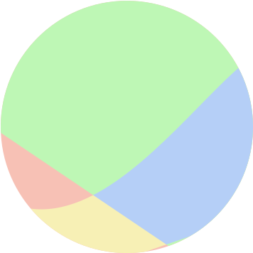

# Daihon LLM Client

## 概要

Daihon は、 [OpenRouter](https://openrouter.ai/) を利用して複数のLLMモデルを用いた柔軟なチャットを支援するアプリケーションです。

[Github Pages](https://standstonecraft.github.io/daihon-llm-client/) に公開してありますので、ご自由にお使いください。

## 要求

- APIキー
  - [OpenRouter](https://openrouter.ai/) アカウントを作成し、APIキーを作成しておく必要があります。
  - 作成したAPIキーは Config 画面に入力してください。
- ブラウザ
  - 最新の Google Chrome または Microsoft edge を使用してください。

## 特徴

- チャット
  - Open AI の ChatGPT に近い使用感
  - モデル共通システムプロンプトの登録
  - 画像送信 (対応モデルのみ)
- メッセージ履歴
  - ユーザーとアシスタントのメッセージ履歴の削除・編集
- モデル管理
  - 使用するモデルの管理・切り替え
  - モデル独自のシステムプロンプトの登録
  - 複数モデルへの同時送信
- プリセット プロンプト
  - よく使うプロンプトの保存
- 出力フォーマット
  - Markdown サポート
  - コードハイライト
  - KaTex (数式) サポート
- データ管理
  - ブラウザの IndexedDB を使用しており、外部にはデータを 送信/保管 しません。
- UI
  - レスポンシブ
  - ダークテーマ / ライトテーマ

## ユースケース

- 意見の取りまとめ
  1. 複数のモデルに質問を送信する
  2. 回答を統合して最終的な結論を出させる
- 台本の修正: 議論を軌道修正するメッセージを追加するよりも楽な場合があります。
  1. アシスタントが誤解して回答する
  2. メッセージ履歴を編集して再送信する
- トークンの節約
  1. 議論の途中で要約させる
  2. 過去のメッセージを削除してトークンを節約する

## 開発

[GitHub](https://github.com/StandstoneCraft/daihon-llm-client)

bun を使用していますが、 bun 独自の機能はコードベース内で使用されていません。

### 技術スタック

- TypeScript 
- Vue 
- Vuetify 
- Vite 
- Dexie (indexedDB)

## ロードマップ / TODO

- チャット
  - [x] メッセージ履歴
  - [x] 複数モデルへの同時送信
  - [x] 画像送信
  - [x] Markdown
  - [x] KaTeX
  - [ ] 履歴の途中にメッセージを追加
  - [ ] ここから 上/下 を削除
  - [ ] フローティングスピードダイヤルボタン 追加、上へ、下へ
- モデル管理
  - [x] モデル独自のシステムプロンプト 
  - [ ] パラメータ管理
  - [ ] テーブル表示に変更?
- コンフィグ 
  - [x] 共通システムプロンプト
  - [x] プリセット プロンプト
- UI
  - [x] レスポンシブ
  - [ ] 多言語対応
